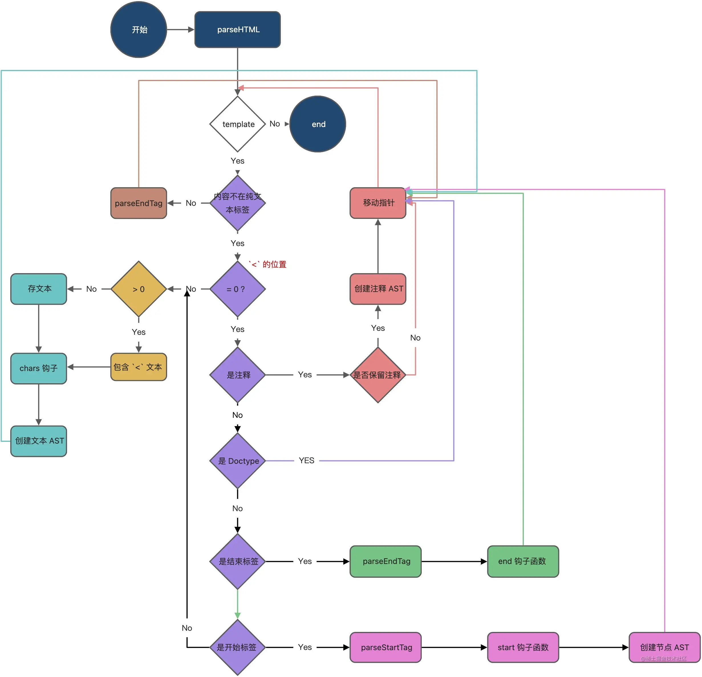
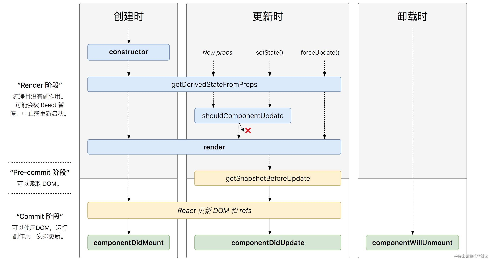

### React Vue 有什么区别

#### render 渲染不同
1. Vue的数据是响应式的，通过Object.defineProperty/Proxy对响应式数据进行依赖收集和订阅通知。能够准确知道数据变化从而进行更新页面
2. React默认是通过比较引用的方式进行的，如果不优化（React.memo, shouldComponentUpdate）可能导致大量不必要的vdom重新渲染

#### 数据流不同
1. Vue可以通过v-model语法糖，实现数据的双向绑定
2. React需要手动的将state做修改

#### diif算法

Vue2的核心Diff算法采用了双端比较的算法，同时从新旧children的两端开始进行比较，借助key值找到可复用的节点，再进行相关操作。React 由于Fiber结构是单向链表，不能通过双端对比，不过可以利用时间切片，合理利用浏览器调度，达到渲染不卡顿的目的。

#### 事件机制不同
1. Vue原生事件使用标准web事件，组件自定义事件机制是父子组件通信基础
2. React原生组件被包装，所有事件都被冒泡到顶层root监听，然后在这里集中合成事件下发。基于这套可以跨端使用事件机制。组件上无事件，父子组件通信通过props

#### 组件化不同
1. Vue 使用 template + js + css Vue单文件
2. React 使用 jsx + inline style 即 all in js

### 虚拟dom是什么，原理是什么？它的优缺点
虚拟dom是对DOM的抽象，本质上是Javascript对象，这个对象对DOM信息和结构的描述
原理：
通过遍历模板字符串，根据模板编码规则解析成AST树，从AST生成渲染函数，渲染函数会返回虚拟dom（Vue）
由babel解析jsx成React.createElement函数，函数会返回虚拟Don（React）
优点：
1. 在生成真实dom之前，可以对新旧vnode做diff算法，以及批处理，减少浏览器的重绘重排
2. 简化开发，使用函数式编程，避免复杂的dom操作（Fn(state) = UI）
3. 有利于跨平台，不仅可以渲染web dom，还可以生成IOS，安卓个平台dom
缺点：
1. 在渲染dom前，虚拟dom都需要做比较，这个比较是看节点数量以及变化程度，这里可能会使拖垮它的性能。
2. 单从创建dom速度是要比原生慢，毕竟它最终仍然使用的是原生API来更新dom，所以第一次挂载dom是一定会比原生慢的。

### Vue 和 React 在虚拟dom的diff上，做了哪些改进使的速度很快

Vue：
- 同级比较，优先比较简单场景 
- 双端比较（这对于列表来说，命中是非常大的，减少了去遍历查找）
- 双端不存在，会去老vnode找（此时会将老vnode生成一个以key为key的map，这样根据key找是O(1)的）
- 如果匹配到会复用移动位置，减少创建与删除节点
- 在生成vnode前，对静态节点以及静态跟节点做了标记，跳过静态节点的比较

React：
- 同级比较，优先比较简单场景
- 第一轮遍历从newChildren于oldFiber去比较
- 第二轮先将老节点生成一个key map去找
- fiber可以中断，当浏览器需要资源时，可以让给浏览器先去执行，当浏览器空闲的时候再继续fiber比较
- fiber双缓存机制，如果节点一样，将复用原节点，节省内存开销

**为什么React不能使用双端比较**
因为Fiber是单向链表结构，这样可以很快的找到fiber节点第一个子节点，下一个兄弟节点，以及父节点，却不容易知道它的前一个Fiber节点是谁。
**为什么Vue不使用时间分片**
时间分片也是有代价的，它需要自己实现一个调度器，然后在调度的过程中切换也会由损耗，并且fiber结构不利于双端比较。Vue触发render更新是通过render watcher来通知的，是再el挂载的时候注册了render watcher，它对template中所用到的data属性进行了依赖收集，所以只有在tempalte用到的响应式数据发生了变化才会触发订阅通知，因此Vue对diff的比较频率天生要比React少且有效，所以使用时间分片的意义不大。

### Vue 和 React 里的key作用是什么？为什么不能用Index？用了会怎样？如果不加key会怎样？
作用：
Key是用来比较两个vnode是否匹配的重要依据（一般都是比较两者key和tag是否一样，Vue还会比较上面的指令比如v-if），另外在比较的过程中，也会对key来进行转成key map结构，优化查找时间复杂度，所以需要保证key的唯一性，可以让比较更快的找到所复用的节点位置。
为什么不能用Index
Index会让节点根据顺序来比较，这样总会匹配得到（在tag一样的情况下），尽管可能移动了位置，但仍然会匹配同一顺序的节点，在深度比较的时候，会将属性（vue指令）替换，从而触发子组件视图的重新渲染等一套很重的逻辑。（其实这里需要分情况：如果是纯展示内容，如静态文本，因为不需要走渲染那套逻辑，而是直接替换，那么它的性能会稍微比唯一id好点，毕竟改变的层级是子节点内容，而非父节点移动位置，如果是带有响应式数据，需要触发重新渲染，那么单纯移动位置性能好太多了）
如果不加key会怎样：
不加的话key都是undefined，因为双端比较就是从新旧start节点开始，结果和index没区别

### Vue 双向绑定的原理是什么？
使用v-model指令实现，实际上是一个语法糖，做了两件事：
1. 为组件添加change事件，并改变value的值
2. 将响应式数据绑定到组件value上

#### 自定义v-model
```js
model: {
  value: 'count',
  event: 'change'
},
props: {
  count: {
    type: Number,
    default: 0
  }
},
methods: {
  change(e) {
    this.$emit('change', e.target.value)
  }
}
```

### Vue keep-alive的作用是什么？怎么实现的，如何刷新

通过虚拟dom将需要keep-alive的虚拟dom缓存起来，下次dom渲染时再扔回去。再created钩子函数调用时将需要缓存的Vnode节点保存在cache中，再render时，如果VNode的name符合缓存条件（include/exclude），则会从cache中取出缓存的VNode实例进行渲染。max是使用LRU算法来控制最大数量的（LRU访问时间LFU访问次数）详见实现LRU算法

### Vue怎么解析template的？template会变成什么
主要做了三件事：
- 解析模板parse，生成AST。（通过正则等方式解析template中的数据，指令，style，class等）
- 优化AST，将静态节点以及静态根节点标记
- 返回render函数以及静态渲染函数数组（render函数返回vnode）

**解析template**
1. 遍历template字符
2. 使用正则匹配注释，开始标签，结束标签，单标签，属性，动态属性等
```js
// 识别合法的xml标签
var ncname = '[a-zA-Z_][\w\-\.]*';

// 复用拼接，这在我们项目中完成可以学起来
var qnameCapture = "((?:" + ncname + "\:)?" + ncname + ")";

// 匹配注释
var comment =/^<!--/;

// 匹配<!DOCTYPE> 声明标签
var doctype = /^<!DOCTYPE [^>]+>/i;

// 匹配条件注释
var conditionalComment =/^<![/;

// 匹配开始标签
var startTagOpen = new RegExp(("^<" + qnameCapture));

// 匹配解说标签
var endTag = new RegExp(("^<\/" + qnameCapture + "[^>]*>"));

// 匹配单标签
var startTagClose = /^\s*(/?)>/;

// 匹配属性，例如 id、class
var attribute = /^\s*([^\s"'<>/=]+)(?:\s*(=)\s*(?:"([^"]*)"+|'([^']*)'+|([^\s"'=<>`]+)))?/;

// 匹配动态属性，例如 v-if、v-else
var dynamicArgAttribute = /^\s*((?:v-[\w-]+:|@|:|#)[[^=]+][^\s"'<>/=]*)(?:\s*(=)\s*(?:"([^"]*)"+|'([^']*)'+|([^\s"'=<>`]+)))?/;
// v-for [\s\S]===[\w\W]代表任意字符 *?懒惰匹配，只匹配一次 *贪婪匹配，匹配任意次
var forAliasRE = /([\s\S]*?)\s+(?:in|of)\s+([\s\S]*)/;
```
3. stack 存储开始标签，遇到结束标签出栈，用以收集节点子节点（每次start开始标签的时候，会stack最后一个标签赋值为它的parent）以及验证template合法性
4. advance 贯穿整个解析过程，扫描字符串，用以移动指针，记录每个AST节点的start，end
5. while 遍历template，根据<的位置分情况解析。
```js
var textEnd = html.indexOf('<');
if (textEnd <  0) {
  // 文本
} else if (textEnd >= 0) {
  while (
     !endTag.test(rest) && // 结束标签
     !startTagOpen.test(rest) && // 开始标签
     !comment.test(rest) && // 注释
     !conditionalComment.test(rest) // 条件注释
   ) {
     next = rest.indexOf('<', 1);
     if (next < 0) { break }
     textEnd += next;
     rest = html.slice(textEnd);
   }
   // 文本中包含<
} else if (textEnd === 0) {
  // 处理开始标签，结束标签，注释等
}
```



### 用过Vue中render吗？render和template有什么关系
template在el挂载后会通过parse解析成render函数，render接受createElement参数，返回createElement结果，两者最终都是返回vnode。
函数式组件（functional）：是无状态的（没有响应式数据，也没有实例this上线问）没有管理任何状态，也没有监听任何传递给它的状态，也没有生命周期方法。实际上，它只是一个接受一些 prop 的函数。
### 了解过Vue3吗
1. Proxy
- 无法监听数组变化。
- 只能劫持对象的属性,因此我们需要对每个对象的每个属性进行遍历，如果属性值也是对象那么需要深度遍历,显然能劫持一个完整的对象是更好的选择。
- proxy 性能更好
- proxy 兼容性问题不好
- 除了 get 和 set 之外，proxy 可以拦截多达 13 种操作，比如 has(target, propKey)，可以拦截 propKey in proxy 的操作，返回一个布尔值。

2. diff
3. option api -> composition API
把相同业务抽离到一起，更方便复杂业务的维护

### React 生命周期


- constructor 子类中需先调用super(props)，通常做两件事：
1. 初始化state
2. 为事件处理函数绑定实例（可以用箭头函数替换）
- render 唯一必须，纯函数，当state或props或useContext发生变化时将调用（shouldComponentUpdate返回true）。可以返回：React元素，数组或fragment，Portals（子节点渲染到存在于父组件以外的 DOM 节点 ），字符串或数值，布尔值或null
- componentDidMount
在组件挂载后立即调用，依赖于DOM节点初始化应该放在这里
- componentDidUpdate
在更新后被立即调用，首次渲染不执行
- componentWillUnmount
在组件卸载及销毁前直接调用，一般执行清理操作
- shouldComponentUpdate
根据函数返回值，判断组件是否受当前state或props更改的影响，默认为true
当props或state发生变化时，shouldComponentUpdate会在渲染执行前被调用，首次渲染或者使用forceUpdate不会调用。
- static getDerivedStateFromProps
在调用render方法之前调用，并且在初始挂载及后续更新都会调用。他应该返回一个对象来更新state，如果返回null则不更新任何内容
与shouldComponentUpdate区别:
1. getDerivedStateFromProps是静态方法
2. getDerivedStateFromProps在挂载和forceUpdate也会调用
3. getDerivedStateFromProps返回新的state会重新渲染,返回null不需要重新渲染;shouldComponentUpdate是返回boolean类型,且在getDerivedStateFromProps触发后执行
- getSnapshotBeforeUpdate
在最近依次渲染输出前（提交到DOM节点）调用。它使得组件能在发生更改前从DOM中捕获一些信息（滚动位置），此生命周期任何返回值将作为参数传给componentDidUpdate
- static getDerivedStateFromError
在后代组件抛出错误后被调用。它将抛出的错误作为参数，并返回一个值以更新 state

### React原理
1. 由babel解析jsx为React.createElement,返回虚拟Dom
2. 使用ReactDOM.render将虚拟dom挂载到container上
3. render初始化wipRoot(root fiber),并将nextUnitOfWork = wipRoot
4. workLoop,基于requestIdleCallback,向浏览器获取控制权,执行performUnitOfWork
5. performUnitOfWork通过深度优先遍历wipRoot下所有节点,并更新wip fiber 树(这里会递归遍历整个fiber tree,所以可以利用shouldComponentUpdate 来优化,减少diff对比)
6. reconcileChildren通过旧fiber与新children做diff对比,将effectTag等信息更新到fiber上
7. 更新完wipRoot后,根据fiber的effectsTag来更新删除创建dom
8. setState会创建一个新的wipRoot,并将nextUnitOfWork = wipRoot,等到浏览器让出控制权将会更新页面
### redux原理

核心：Store存储state数据集合 action改变state的指令 Reducer接受action来改变store状态
通过createStore创建一个store，其中：
1. store.subscribe：订阅state的变化，当state变化的时候执行回调，可以有多个subscribe，里面的回调会依次执行
2. store.dispatch：触发action的方法，每次dispatch(action)都会执行reducer生成新的state，然后执行subscribe注册的回调
3. store.getState：返回当前state
这是一个发布订阅模式

#### 为什么 Vuex 的 mutation 和 Redux 的 reducer 中不能做异步操作？
为了保证状态可预测：
- 单一数据源state
- state只读，没有暴露直接修改state接口，只能通过dispatch(action)来修改
- reducer必须是纯函数，没有副作用才能保证state可预测

### useRef / ref / forwardRef 的区别是什么?
- useRef 返回一个可变的ref对象，其.current属性被初始化为传入参数，更变current不会引起组件重新渲染，无论在生命周期任何节点使用current始终返回最新的值。（useRef存的是个引用地址，所以current的更新不会引起组件更新，且获取始终最新值）通常和ref一起使用。
- useImperativeHandle 可以让你在使用ref时自定义暴露父组件实例，通常和forwardRef一起使用
```js
function FancyInput(props, ref) {
  const inputRef = useRef();
  useImperativeHandle(ref, () => ({
    focus: () => {
      inputRef.current.focus();
    }
  }));
  return <input ref={inputRef} ... />;
}
FancyInput = forwardRef(FancyInput);
```
渲染 <FancyInput ref={inputRef} /> 的父组件可以调用 inputRef.current.focus()。


### useEffect的第二个参数, 传空数组和传依赖数组有什么区别?
传空只会执行一遍，传数组会根据数组中的依赖值变化而执行
### 如果return 了一个函数, 传空数组的话是在什么时候执行? 传依赖数组的时候是在什么时候执行?
传空是在组件销毁前执行，传依赖数组是在依赖组件修改时，执行上一个effect对应的清除执行

### hooks解决了什么问题
1. 组件之间逻辑或者状态复用（共享状态逻辑），旧的实现使用render props 或者高阶组件
2. 类组件逻辑复杂的组件难以开发与维护，函数组件可以将相关逻辑放在一块，不需要按照生命周期来放至
3. 类组件this增加学习成本，hooks不需要考虑this
### Vue React 通信
Vue:
1. 属性通过props，方法回调通过@emit
2. inject，provide(祖孙组件)
3. Bus（兄弟组件）
3. Vuex

React:
1. 属性，方法回调全是通过props
2. useContext(祖孙组件)
3. 自定义事件机制EventEmitter（兄弟组件）
4. Redux

### React 虚拟Dom如何转成真实Dom的
**虚拟Dom由来**：
由babel将jsx转化成React.reacteElement(),reacteElement函数返回的就是vnode，最终通过RenderDOM.render(vnode, container[, callback])将虚拟dom挂载到真实Dom上去。
```js
function createElement(type, config, ...children) {
  // 对props做处理
  const props = {
    ...config,
    children: children.map(child => typeof child === 'object' ? child : createTextNode(child)) 
  }
  return {
    type,
    props
  }
}
function createTextNode(text) {
    return {
        type: TEXT,
        props: {
            children: [],
            nodeValue: text
        }
    };
}
```
createElement 会根据传入的节点信息进行判断
- 原生标签节点，type是字符串，如div
- 文本节点，type是Text标识
- 函数组件，type是函数本身
- 类组件， type是类构造函数

### Vue 如何对数组进行响应式的
- 重写改变原数组的7个方法（push pop unshift shift sort splice reverse）
- 对有新增元素的方法的新增值进行依赖收集（push unshift splice）
- 手动调用notify，触发订阅通知

### nextTick原理
响应式数据更新后，会触发dep.notify，通知dep中手机的watcher去执行update方法。 将对应所有watcher放入一个watcher队列中（这里会做去重和排序处理）。
然后通过nextTick方法将刷新watcher队列的方法（flushSchedulerQueue）放入一个全局callbacks数组中（包含用户nextick回调函数）
如果此时浏览器异步任务队列没有flushCallbacks函数在执行，则执行timerFunc函数，将flushCallbacks函数放入异步队列中（异步队列方法会降级处理promise mutationobserver setImmidiate setTimeout）。如果异步队列中存在flushCallbacks函数，等待其执行完成后再放入下一个flushCallbacks函数
- flushCallbacks：执行当前所有callbacks数组中的flushSchedulerQueue函数
- flushSchedulerQueue：负责刷新watcher队列，执行queue数组中美国和watcher.run，从而进行更新阶段