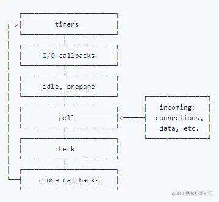
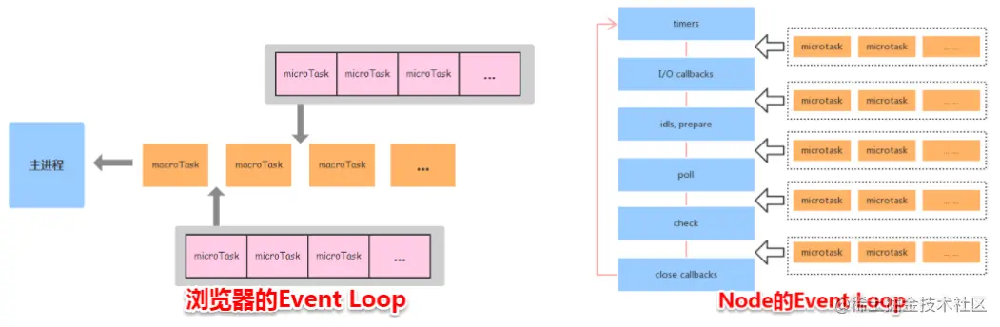

## 什么是Node.js
Node.js 是一个开源与跨平台的 JavaScript 运行时环境

在浏览器外运行 V8 JavaScript 引擎（Google Chrome 的内核），利用事件驱动、非阻塞和异步输入输出模型等技术提高性能

可以理解为 Node.js 就是一个服务器端的、非阻塞式I/O的、事件驱动的JavaScript运行环境

### 非阻塞异步
Nodejs采用了非阻塞I/O机制，在做I、O操作的时候不会造成任何的阻塞。
例如执行了访问数据库的代码后，将立即转而执行其后面的代码，把数据库返回结果的处理代码放在回调函数中，从而提高了程序的执行效率。
### 事件驱动
事件驱动就是当今来一个新的请求时，请求将会被压入一个事件队列，然后通过一个循环来检查队列中的时间状态变化，如果检测到状态变化的事件，那么就执行该事件对应的处理代码，一般都是回调函数。
比如读取一个文件，文件读取完毕后，就会触发对应的状态，然后通过对应的回调函数来进行处理

### 优缺点
优点：
- 处理高并发场景性能更佳
- 适合I/O密集型应用
缺点：单线程
- 不适合CPU密集型应用
- 支支持单核CPU，不能充分利用CPU
可靠性低，一旦代码某个环节崩溃，整个系统都崩溃

## 全局对象
- process 进程对象，提供有关当前进程的信息和控制。
  1. process.cwd 返回当前Node进程执行的目录
  2. process.argv 返回执行node程序参数，是一个数组，参数从index=2开始0：Node路径，1：被执行的JS文件路径2-n：参数。
  3. process.env 运返回一个对象，存储当前环境相关的所有信息 如process.env.NODE_ENV
  4. process.nextTick() 我们都知道NodeJS是基于事件轮询，在这个过程中，同一时间只会处理一件事情。在这种处理模式下，process.nextTick()就是定义出一个动作，并让这个动作在下一个轮询的时间点上执行。
  ```js
  function foo() {
    console.error('foo');
  }
  process.nextTick(foo);
  console.error('bar');
  ```
  输出结果为bar、foo
  ```js
  setTimeout(foo, 0);
  console.log('bar');
  ```
  结果一样，区别在于：process.nextTick()会在这一次event loop的call stack清空后（下一次event loop开始前）在调用callback，setTimeout并不知道什么时候call stack清空，所以何时调用callback函数是不确定的。
  还包括一些版本信息，操作系统等。
- console 用来答应stdout和stderr
- clearInterval、setInterval clearTimeout、setTimeout

### 模块级别的全局对象
这些全局对象是模块中的变量，只是每个模块都有，看起来就像全局变量，像在命令交互中是不可以使用，包括：
- __dirname 获取当前文件所在的路径，不包括后面的文件名
- __filename 获取当前文件所在的路径和文件名称，包括后面的文件名称
- exports module.exports 用于指定一个模块所导出的内容，即可以通过 require() 访问的内容
- module 对当前模块的引用，通过module.exports 用于指定一个模块所导出的内容，即可以通过 require() 访问的内容
- require 用于引入模块、 JSON、或本地文件。 可以从 node_modules 引入模块。

## Event Loop
Node采用V8作为js的解析引擎，而IO处理使用了自己设计的libuv。libuv是一个基于事件驱动的跨平台抽象层，封装了不同操作系统一些底层特性，对外提供统一的API，事件循环机制也是它里面的实现。

Node运行机制：
- V8引擎解析Javascript脚本
- 解析后的代码调用Node API
- libuv库负责Node API的执行。它将不同的任务分配给不同的线程，形成一个EventLoop，以异步的方式将任务的执行结果返回给V8引擎
V8引擎再将结果返回给用户。

### 六个阶段

外部输入数据 --> 轮询阶段（poll） --> 检查阶段（check） --> 关闭事件回调阶段（close callbacks） --> 定时器检查阶段（timer） --> I/O事件回调阶段(I/O calbacks) --> 闲置阶段（idle，prepare） --> 轮询阶段（按照该顺序反复运行）

- timer 阶段：这个阶段执行timer回调（setTimeout，setTinerval）
- I/O callbacks 阶段：处理一些上一轮循环中的少数未执行的I/O回调
- idle，prepare 阶段：仅node内部使用
- poll 阶段：获取新的I/O事件，适当条件下node将阻塞这里
- check 阶段：执行setImmediate() 回调
- close callbacks 阶段：执行socket 的close 事件回调

#### timer

timer 阶段执行setTimeout 和setInterval回调，并且是由poll阶段控制的，同样，在Node中定时器指定的事件也不是准确事件，只能尽快执行。

#### poll
poll 阶段做两件事情：
1. 回到timer阶段执行回调
2. 执行I/O回调
如果没有设定timer，会发生：
- 如果poll队列不为空，会遍历回调队列并同步执行，知道队列为空或达到系统限制
- 如果pill队列为空：
  - 如果setImmediate回调需要执行，poll阶段会停止并且进入check阶段执行回调
  - 如果没有setImmediate 回调需要执行，会等待回调被加入到队列中并立即执行回调，这样同样会有个超时时间设置防止一直等待
如果设定了timer且poll为空，则会判断是否有timer超时，如果有回到timer阶段执行回调。

#### check
setImmediate回调会被加入check队列，check阶段在poll之后。

### Node 中的宏任务和微任务
- 宏任务：setTimeout，setInterval，setImmediate，script，I/O
- 微任务：process.nextTick，new Promise().then

#### setTimeout vs setImmediate
两者非常相似，区别在于调用时机不同：
- setImmediate在poll阶段完成时执行，即check阶段
- setTimeout 在poll阶段空闲时，且设定时间到达后执行，但它在timer阶段执行。
```js
setTimeout(() => {
  console.log('timeout)
})
setImmediate(() => {
  console.log('immediate)
})
```
以上代码，可能是setTimeout先执行，也有可能时setImmediate先执行。进入事件循环也是需要成本的，如果在准备时候花费大于1ms时间，那么在timer阶段就会执行执行setTimeout回调，如果准备时间小于1ms，那么就是setImmediate回调先执行。

但是当两者在异步I/O内部调用，总是setImmediate先执行
```js
const fs = require('fs')
fs.readFile(__filename, () => {
    setTimeout(() => {
        console.log('timeout');
    }, 0)
    setImmediate(() => {
        console.log('immediate')
    })
})
// immediate
// timeout
```
因为两者在IO回调执行，IO回调在poll阶段执行，当回调执行完毕后队列为空，发现存在setImmediate回调，所以就执行跳转到check阶段去执行回调了。

### process.nextTick
这个函数其实是独立于Event Loop之外的，它有一个自己的队列，当每个阶段完成后，如果存在nextTick队列，就会清空队列中所有回调函数，并优先于其他微任务执行。
```js
setTimeout(() => {
 console.log('timer1')
 Promise.resolve().then(function() {
   console.log('promise1')
 })
}, 0)
process.nextTick(() => {
 console.log('nextTick')
 process.nextTick(() => {
   console.log('nextTick')
   process.nextTick(() => {
     console.log('nextTick')
     process.nextTick(() => {
       console.log('nextTick')
     })
   })
 })
})
// nextTick=>nextTick=>nextTick=>nextTick=>timer1=>promise1
```

### Node 事件循环 vs 浏览器 事件循环

浏览器环境下，微任务的队列是每个宏任务执行完后执行的（一开始是script代码块）。而Node中，微任务会在事件循环的各个阶段之间执行，也就是一个阶段执行完毕，就会执行微任务队列任务。



```js
setTimeout(()=>{
    console.log('timer1')
    Promise.resolve().then(function() {
        console.log('promise1')
    })
}, 0)
setTimeout(()=>{
    console.log('timer2')
    Promise.resolve().then(function() {
        console.log('promise2')
    })
}, 0)
// 浏览器：timer1->promise1->timer2->promise2
// node: node11+ 一旦执行一个阶段里的一个宏任务就立刻执行微任务队列，这个浏览器运行一致：timer1->promise1->timer2->promise2
// node 10- 要看第一个定时器执行完，第二个定时器是否在完成队列中。如果第二个定时器还未在完成队列中，结果：timer1->promise1->timer2->promise2。如果第二个任务定时器已经在完成队列中：timer1->timer2->promise1->promise2
```
node运行过程：
1. 全局脚本（main）执行，将2个timer一次放进timer队列，main()执行完毕调用栈空闲，任务队列开始执行
2. 首先进入timer阶段，执行timer1的回调函数，答应timer1，并将promise1.then回调放入微任务队列，同样步骤执行timer2，和打印timer2
3. 至此，timer阶段执行结束，event loop进入下一个阶段前，执行微任务队列所有任务，依次打印promise1，promise2
总结：
- Node端，microtask 在事件循环的各个阶段之间执行
- 浏览器端，microtask 在事件循环的 macrotask 执行完之后执行
