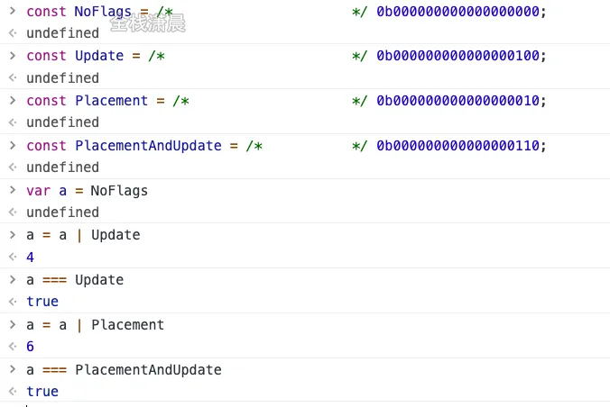

## 组件基础
## React 事件机制
```jsx
<div onClick={this.handleClick.bind(this)}>点我</div>
```
React 并不是将click事件绑定到div的真实DOM上，而是在document处监听了所有的事件，当事件发生并且冒泡到document处的时候（React17代理到root容器节点），React将事件内容封装并交由真正的处理函数运行。这样不仅仅减少了内存的消耗，还能再组件挂载销毁时统一订阅和移除事件。
除此之外，冒泡到document上的事件也不是原生的浏览器事件，而是有React自己实现的合成事件（SyntheticEvent）。因此如果不想要事件冒泡的话应该调用（xxx），而不是调用event.stopPropagation()（只会阻止合成事件的冒泡，但是原生事件先执行，所以原生事件还会执行）。
原生冒泡事件是冒泡的过程中触发事件，而合成事件是会在冒泡到document后统一触发事件（按照冒泡顺序），当然document上的事件最后触发。
```jsx
import  React  from 'react';
class App extends React.Component{

  constructor(props) {
    super(props);
    this.parentRef = React.createRef();
    this.childRef = React.createRef();
  }
  componentDidMount() {
    console.log("React componentDidMount！");
    this.parentRef.current?.addEventListener("click", () => {
      console.log("原生事件：父元素 DOM 事件监听！");
    });
    this.childRef.current?.addEventListener("click", () => {
      console.log("原生事件：子元素 DOM 事件监听！");
    });
    document.addEventListener("click", (e) => {
      console.log("原生事件：document DOM 事件监听！");
    });
  }
  parentClickFun = () => {
    console.log("React 事件：父元素事件监听！");
  };
  childClickFun = () => {
    console.log("React 事件：子元素事件监听！");
  };
  render() {
    return (
      <div ref={this.parentRef} onClick={this.parentClickFun}>
        <div ref={this.childRef} onClick={this.childClickFun}>
          分析事件执行顺序
        </div>
      </div>
    );
  }
}
export default App;
```
```log
原生事件：子元素 DOM 事件监听！ 
原生事件：父元素 DOM 事件监听！ 
React 事件：子元素事件监听！ 
React 事件：父元素事件监听！ 
原生事件：document DOM 事件监听！ 
```
如果在childClickFun添加event.stopPropagation原生事件照常执行，只阻止了React 事件，父元素上事件。e.nativeEvent.stopImmediatePropagation会阻止最外层document上事件监听。
举一个使用e.nativeEvent.stopImmediatePropagation实际案例：实现点击空白处关闭菜单的功能： 当菜单打开时，在 document 上动态注册事件，用来关闭菜单。
- 点击菜单内部，由于不冒泡，会正常执行菜单点击。
- 点击菜单外部，执行document上事件，关闭菜单。
实现合成事件的目的如下：
- 合成事件抹平了浏览器之间的兼容问题，另外这是一个跨浏览器原生事件包装器，赋予了浏览器开发的能力。
- 对于原生浏览器来说，浏览器会给监听器创建一个事件对象，如果你有很多事件监听，那么就需要分配很多事件对象，造成高额的内存分配问题，但是对于合成事件来说，就会从池子里复用事件，事件回调结束就会销毁事件对象上的属性，从而便于下次复用事件对象。

### 为什么要从document改成 root
这主要是为了渐进升级，避免多版本的React共存的场景中事件系统发生冲突。有利于多个react版本共存，例如微前端（document只有一个，root节点可以有多个）
在 React 17 以前，所有的事件会被附加到 document 上，并为它建一个处理器，当 DOM 事件触发时，会向上冒泡，一直到 document 级别，也就是附加事件处理器的地方，事件会得到响应。
如果页面上有多个React版本，事件都会被附加在document上。这时嵌套的React树调用e.stopPropagation()停止了事件冒泡，外部的树仍然会接收到该事件，这就使嵌套不同版本的React难以实现。
### React如何实现自己的事件机制？
组件挂载，更新时：
- 通过`lastProps`,`nextProps`判断时候新增，删除事件分别调用事件注册，卸载方法。
- 调用EventPluginHub的enqueuePutListener进行事件存储
- 获取document对象
- 根据事件名称（onClick，onCaptureClick）判断式进行冒泡还是捕获
- 判断是否存在addEvenetListener方法，否则使用attachEvent（IE）
- 给document注册原生事件回调为disptchEvent（统一的事件分发机制）
事件初始化：
- EventPlugin负责管理React合成时间的callback，他将callback存储在listenerBank中。
- 获取绑定事件的元素的唯一标识 key。
- 将 callback根据事件类型，元素的唯一标识 key存储在 listenerBank中。
- listenerBank的结构是： listenerBank[registrationName][key]。
触发事件时：
- 触发document注册原生事件回调dispatchEvent
- 获取到触发这个事件最深一级的元素
- 遍历这个元素的所有父元素，依次对每一级元素进行处理。
- 构造合成事件。
- 将每一级的合成事件存储在 eventQueue事件队列中。
- 遍历 eventQueue。
- 通过 isPropagationStopped判断当前事件是否执行了阻止冒泡方法。
- 如果阻止了冒泡，停止遍历，否则通过 executeDispatch执行合成事件。
- 释放处理完成的事件。

### 为什么class component需要绑定bind
类比Class
```js
class Foo {
  constructor(name){
    this.name = name
  }

  display(){
    console.log(this.name);
  }
}

var foo = new Foo('Saurabh');
foo.display(); // Saurabh

//下面的赋值操作模拟了上下文的丢失。 
//与实际在 React Component 中将处理程序作为 callback 参数传递相似。
var display = foo.display; 
display(); // TypeError: this is undefined
```
类声明和类表达式的主体以 严格模式 执行，主要包括构造函数、静态方法和原型方法。Getter 和 setter 函数也在严格模式下执行。所以此时this是undefined。

## React的事件和普通的HTML事件有什么不同
区别：
- 对于事件名称命名方式，原生事件为全小写，对大小写不敏感，react事件采用小驼峰；可以看出来Vue使用的是原生事件，所以推荐始终使用 kebab-case 的事件名（@my-event="xxx"）。
- 对于事件函数处理语法，原生事件为字符串，react事件为函数。
- react事件不能采用 return false 的方式来组织浏览器的默认行为，而必须明确的调用preventDefault。
```html
<a href="www.baidu.com" onclick="return false">a</a>
```
合成事件时react模拟原生DOM事件所有能力的一个事件对象，优点：
- 兼容所有浏览器，更好的跨平台。
- 将事件统一放在一个数组，避免频繁新增与删除（垃圾回收）
- 方便react统一管理和事务机制。
事件的机制顺序为原生事件先执行，合成事件后执行，合成事件会冒泡绑定到document上，所以尽量避免原生事件与合成事件混用，如果原生事件阻止冒泡，可能会导致合成事件不执行，因为需要冒泡到document上合成事件才执行。

## React 组件中怎么做事件代理，它的原理是什么？
React基于Virtual DOM 实现了一个SyntheticEvent层（合成事件层），定义的事件处理器会接受到一个合成事件对象的实例，它符合W3C标准，与原生浏览器事件拥有同样的接口，支持冒泡机制，所有的事件都将自动绑定在最外层。
在React底层，主要对合成事件做了两件事情：
- 事件委派:React汇报所有的事件绑定到结构的最外层，使用统一的事件监听器，这个事件监听器上维持了一个映射来保存所有组件内部事件监听和处理函数。
- 自动绑定：React组件中，每个方法的上下文都会指向该组件的实例，及自动绑定this为当前组件。

## React 高阶组件，Render props， hook有什么区别，为什么要不断迭代？
这三者时目前React解决代码复用的主要方式：
- 高阶组件（HOC）时React中用于复用组件逻辑的一种高级技术。HOC自身不是React API的一部分，他是一种基于React的组合特性而形成的设计模式。具体而言，高阶组件的参数为组件，返回值为新组件的函数。
```jsx
// 定义HOC
function withSubscription(WrappedComponent, data) {
  return function(props) {
    // 一些通用逻辑处理
    // ...
    // 并使用新数据渲染被包装的组件
    return <WrappedComponent data={data} {...props} />
  }
}
// 使用
const BlogPostWithSubscription = withSubscription(BlogPost, data)
```
优缺点：
1. 优点：逻辑复用，不影响被包裹组件的内部逻辑。
2. 缺点：HOC传递给被包裹组件的props容易和被包裹后的组件重名。进而被覆盖。
- render props 是指一种在React组件之间使用一个值为函数的prop共享代码的简单技术，更具体的说，render prop 是一种用于告知组件需要渲染什么内容的函数prop
```jsx
function DataProvider ({render}) {
  const [data, setData] = useState({name: 'Tom'})
  return (<div>
    <p>共享数据组件自己内部渲染逻辑</p>
    { render(data) }
  </div>)
}
<DataProvider render={data => <h1>Hello {data.name}</h1>} />
```
优缺点：
1. 优点：数据共享，代码复用，将组件内state所谓props传递给调用者，将渲染逻辑交给调用者。
2. 缺点：无法在return 语句外访问数据，嵌套写法不够优雅。
- 自定义hook，它可以让你在不编写 class 的情况下使用 state 以及其他的 React 特性。通过自定义hook，可以复用代码逻辑。
```jsx
function useSubscription() {
  const data = DataSource.getComments()
  return [data]
}
function CommentList({data}) {
  const [subData] = useSubscription()
  // ...
}
<CommentList data='hello' />
```
优缺点：
1. 使用直观
2. 解决HOC props 重名问题
3. 解决render props 因共享数据 而出现嵌套地狱问题
4. 能在return之外使用数据的问题

## 为何React事件要自己绑定this？
事件处理函数是直接调用的，并没有指定调用的组件。
```js
// 模拟React 类丢失上下文
class Foo {
  constructor(name){
    this.name = name
  }

  display(){
    console.log(this.name);
  }
}

var foo = new Foo('Saurabh');
foo.display(); // Saurabh

//下面的赋值操作模拟了上下文的丢失。 
//与实际在 React Component 中将处理程序作为 callback 参数传递相似。
var display = foo.display; 
display(); // TypeError: this is undefined 严格模式
```

## React 的 setState 是同步还是异步？

- 在生命周期函数和合成事件中：
1. 无论调用多少次setState，都不会立即执行更新。而是将更新的state存入`_pendingStateQueue`，将要更新的组件存入`dirtyComponent`；
2. 当根组件didMount后，批处理机制会更新为（isBatchingUpdates）false。此时再取出`_pendingStateQueue`和`dirtyComponent`中的state和组件进行合并更新。
- 原生事件和异步代码中：
1. 原生事件不会触发react批处理机制，因而调用setState会直接更新。
2. 异步代码中调用setState，由于js异步处理机制，异步代码会暂存，等待同步代码执行完毕在执行，此时React批处理机制已经结束，因为直接更新（从这里也能看出批处理机制实际上并不是真正的异步，本身执行的还是同步代码，只是合成事件和钩子函数的调用在更新前执行，导致在合成事件和钩子函数中没法立马拿到更新的值）
React 18 setTimeout执行的是“异步”了。因为默认开启了concurrent 模式

## Render 流程
1. render过程首先会创建fiber树
每个组件对应一个fiber树，每个fiber都是一个任务单元。

fiber为了更方便找到下一个任务单元，每个fiber都会指向他的第一个子节点（child），它的下一个兄弟节点（sibling）和父节点（parent）
```jsx
ReactDom.render(
  <div>
    <h1>
      <p />
      <a />
    </h1>
    <h2 />
  </div>,
  container
)
```
当我们处理完一个fiber节点后。它的child fiber节点将作为下一个任务单元，如果没有child，它的兄弟节点作为下一个任务单元，如果既没有child，也没有sibling，那么会找它的parent的sibling，如果再没有会去找父的父的兄弟，或者知道达到根节点，到达根节点意味着完成了整个树的render（深度优先）
div -> h1 -> p -> a -> h2
mounted是后续遍历
p -> a -> h1 -> h2 -> div
为什么要这样做？猜想：如果从顶端开始遍历（广度优先），那么会导致一个问题，创建完div后触发mounted，然后创建h1完成后，因为div子节点有变化，再次触发mounted。之后还会触发很多很多次的mounted。。。

2. Reconciliation 比较新生成的fiber树和上次提交到DOM的fiber树（diff）
- 对于新旧节点类型是相同的情况，复用旧的DOM，仅修改上面的属性，effectTags标记为'UPDATE'
- 如果类型不同，需要创建一个新的DOM节点,effectTags标记为'PLACEMENT'
- 如果类型不同，并且旧节点存在的话，需要把就节点DOM给移除。effectTags标记为'DELETION'，并将放入deletions数组中，因为后续commitWork不会遍历旧Fiber树，而是只遍历deletions和新Fiber树
React使用key这个属性来优化reconcliliation过程，比如key属性可以用来检测elements数组中的子组件是否仅仅更换了位置

## 对比React15，它的缺陷

在Reconciler中，mount的组件会调用mountComponent (opens new window)，update的组件会调用updateComponent (opens new window)。这两个方法都会递归更新子组件。
- 递归执行一旦开始，中途无法中断。复杂的页面对应深层次的递归会导致浏览器卡顿（浏览器GUI渲染线程和JS线程是互斥的，他们不能同时执行，所以如果JS脚本执行过长16.6ms就会阻塞GUI渲染从而导致卡顿）

## React架构
- Scheduler（调度器）--调度任务的优先级，高优任务优先进入Reconciler
- Reconciler（协调器） -- 负责找出变化的组件
- Renderer（渲染器） -- 负责将变化的组件渲染到页面上

### Scheduler（调度器）
会在浏览器空闲的时候调度任务，再浏览器渲染的时候中断任务。
部分浏览器本身提供了这样的API（requestIdleCallback），但是由于：
- 浏览器不兼容
- 触发频率不稳定，受很多因素影响。比如当我们的浏览器切换tab后，之前tab注册的requestIdleCallback触发的频率会变得很低
所以，React是实现了功能更完备的requestIdleCallback polyfill。

### Reconciler（协调器）
在处理虚拟DOM的时候，可以中断的循环过程。每次循环都会调用shouldYield判断当前是否有剩余时间
```js
function workLoopConcurrent() {
  // Perform work until Scheduler asks us to yield
  while (workInProgress !== null && !shouldYield()) {
    workInProgress = performUnitOfWork(workInProgress);
  }
}
```
这会导致一个问题：中断更新时DOM渲染不完全。React如何解决的：
Reconciler与Renderer不在是交替工作。当Scheduler将任务交给Reconciler后，Reconciler会为变化的虚拟DOM打上增删更新的标记。
```js
export const Placement = /*             */ 0b0000000000010;
export const Update = /*                */ 0b0000000000100;
export const PlacementAndUpdate = /*    */ 0b0000000000110;
export const Deletion = /*              */ 0b0000000001000;
```
整个Scheduler与Reconciler的工作都在内存中进行。只有当所有组件都完成Reconciler的工作，才会统一交给Renderer

### Renderer（渲染器）
Renderer根据Reconciler为虚拟DOM打的标记，同步执行对应的DOM操作

## Fiber
- 作为架构来说，每个Fiber节点有个对应的React element，多个Fiber如何连接形成树？
```js
// 指向父级的Fiber节点
this.return = null
// 指向子Fiber节点
this.child = null
// 指向右边第一个兄弟节点
this.sibling = null
```
- 作为静态的数据结构，保存了组件相关的信息
```js
// Fiber对应的组件类型，如Function、Class
this.tag = tag;
// key属性
this.key = key;
// 大部分情况同type，某些情况不同，如FunctionComponent使用React.memo包裹
this.elementType = null;
// 对于FunctionComponent指函数本身，对于ClassComponent，指class，对于HostComponent(原生DOM组件)，指DOM节点tagName
this.type = null
// Fiber对应的真实的DOM节点
this.stateNode = null;
```
- 作为动态的工作单元，Fiber中如下参数保存了本次更新相关信息：
```js
// 保存本次更新造成的状态改变相关信息
this.pendingProps = pendingProps;
this.memoizedProps = null;
this.updateQueue = null;
this.memoizedState = null;
this.dependencies = null;

this.mode = mode;

// 保存本次更新会造成的DOM操作
this.effectTag = NoEffect;
this.nextEffect = null;

this.firstEffect = null;
this.lastEffect = null;

// 调度优先级相关
this.lanes = NoLanes;
this.childLanes = NoLanes;
```

### 双缓存Fiber树
在React中最多会同时存在两颗Fiber树。当前屏幕显示内容对应的Fiber树成为current Fiber树，正在内存中构建的Fiber树称为workInProgress Fiber树。
current fiber树的Fiber节点成为 current fiber，workInProgress Fiber树中Fiber节点被成为workInProgress fiber，他们通过alternate属性连接。
```js
currentFiber.alternate = workInProgressFiber;
workInProgressFiber.alternate = currentFiber;
```
React应用的根节点通过使current指针在不同Fiber树的rootFiber间切换来完成current Fiber树指向的切换。

即当workInProgress Fiber树构建完成交给Renderer渲染在页面上后，应用根节点的current指针指向workInProgress Fiber树，此时workInProgress Fiber树就变为current Fiber树。

每次状态更新都会产生新的workInProgress Fiber树，通过current与workInProgress的替换，完成DOM更新。
优点：
- 减少内存分配和垃圾回收：WIP节点不完全是新的，比如某子树不需要变动，React会复用旧树中的子树
- 异常的处理，比如当一个节点抛出异常，仍然可以继续沿用旧树的节点，避免整棵树挂掉。

### mount时
```jsx
function App() {
  const [num, add] = useState(0);
  return (
    <p onClick={() => add(num + 1)}>{num}</p>
  )
}

ReactDOM.render(<App/>, document.getElementById('root'));
```
1. 首次执行 ReactDom.render 会创建fiberRoot（整个应用的根节点）和rootFiber（<App />所在组件树的根节点）。
之所以要区分fiberRoot和rootFiber，是因为在应用中我们可以多次调用ReactDom.render 渲染不同的组件树，他们会拥有不同的rootFiber。但是整个应用根节点只有一个，那就是fiberRoot。
fiberRoot的current会指向当前页面一渲染内容对应的Fiber树，即current Fiber树。
```jsx
fiberRoot.current = rootFiber
```
由于是首屏渲染，页面中还没有挂载任何DOM，所以fiberRootNode.current指向的rootFiber没有任何子Fiber节点（即current Fiber树为空）。
2. 接下来进行render阶段，根据组件返回的JSX在内存中创建Fiber节点并连接在一起构建Fiber树，被称为 workInProgress Fiber树。
在构建workInProgress Fiber树时会尝试复用current Fiber树中已有的Fiber节点内的属性，在首屏渲染时只有rootFiber存在对应的current fiber（即rootFiber.alternate）。
3. 构建完的workInProgress Fiber 树在commit阶段渲染到页面。
此时DOM更新为右侧树对应的样子。fiberRootNode的current指针指向workInProgress Fiber树使其变为current Fiber 树。

### update时
1. 接下来我们点击p节点触发状态改变，这回开启一次新的render阶段，并构建一个新的workInProgress Fiber 树。
和mount时一样，workInProgress fiber的创建可以复用current Fiber树对应的节点数据。
2. workInProgress Fiber 树在render阶段完成构建后进入commit 阶段渲染到页面上。渲染完成后 workInProgress Fiber 树 变成 current Fiber树。

## 深入JSX
JSX在编译时会被Babel编译为React.createElement方法。所以在每个使用JSX的文件中，必须要显示声明
```js
import React from 'react'
```
否则运行时该模块内就会报错未定义变量React的错误。

### React.createElement
React.createElement最终会调用ReactElement方法返回一个包含组件数据的对象，该对象有个参数$$typeof: REACT_ELEMENT_TYPE标记了该对象是个React Element。

### React Component
```jsx
class AppClass extends React.Component {
  render() {
    return <p>KaSong</p>
  }
}
console.log('这是ClassComponent：', AppClass);
console.log('这是Element：', <AppClass/>);


function AppFunc() {
  return <p>KaSong</p>;
}
console.log('这是FunctionComponent：', AppFunc);
console.log('这是Element：', <AppFunc/>);
```
ClassComponent对应的Element的type字段为AppClass自身。
FunctionComponent对应的Element的type字段为AppFunc自身，
值得注意的一点，由于
```js
AppClass instanceof Function === true;
AppFunc instanceof Function === true;
```
所以无法通过引用类型区分ClassComponent和FunctionComponent。React通过ClassComponent实例原型上的isReactComponent变量判断是否是ClassComponent。
```js
ClassComponent.prototype.isReactComponent = {};
```

### JSX与Fiber节点
从上面的内容我们可以发现，JSX是一种描述当前组件内容的数据结构，他不包含组件schedule、reconcile、render所需的相关信息。

比如如下信息就不包括在JSX中：
- 组件在更新中的优先级
- 组件的state
- 组件被打上的用于Renderer的标记
这些内容包含在Fiber节点中
所以，在组件mount时，Reconciler根据JSX描述的组件内容生成组件对应的Fiber节点。

在update时，Reconciler将JSX与Fiber节点保存的数据对比，生成组件对应的Fiber节点，并根据对比结果为Fiber节点打上标记。

## Fiber中的effectTag

effectTag表示对应的DOM操作类型
```js
// DOM需要插入到页面中
export const Placement = /*                */ 0b00000000000010;
// DOM需要更新
export const Update = /*                   */ 0b00000000000100;
// DOM需要插入到页面中并更新
export const PlacementAndUpdate = /*       */ 0b00000000000110;
// DOM需要删除
export const Deletion = /*                 */ 0b00000000001000;
```
通过二进制表示effectTag，可以方便的使用位操作为fiber.effectTag赋值多个effect。

假设mountChildFibers也会赋值effectTag，那么可以预见mount时整棵Fiber树所有节点都会有Placement effectTag。那么commit阶段在执行DOM操作时每个节点都会执行一次插入操作，这样大量的DOM操作是极低效的。
在mount时只有rootFiber会赋值Placement effectTag，在commit阶段只会执行一次插入操作。

## Commit 阶段
- before mutation 阶段（执行DOM操作前）
- mutation 阶段 （执行DOM操作）
- layout 阶段 （执行DOM操作后）

## Diff

- 只对同级元素进行Diff。如果一个DOM节点在前后两次更新中跨越了层级。那么React不会尝试复用它。
- 两个不同类型的元素会生成不同的树。如果元素由div变成p，React会销毁div及其子孙节点，并创建p及其子孙节点。
- 开发者可以通过key来暗示哪些子元素在不同的渲染能保持稳定。
```jsx
// 更新前
<div>
  <p key="ka">ka</p>
  <h3 key="song">song</h3>
</div>

// 更新后
<div>
  <h3 key="song">song</h3>
  <p key="ka">ka</p>
</div>
```
如果没有key，React会认为div的第一个子节点由p变为h3，第二个子节点由h3变为p。这符合限制2的设定，会销毁并新建。

但是当我们用key指明了节点前后对应关系后，React知道key === "ka"的p在更新后还存在，所以DOM节点可以复用，只是需要交换下顺序。

单节点DIFF比较：
- 同级child比较，只有key和type都相同，才能复用。
- 如果key不同，直接不考虑其他，直接将fiber标记为删除，不能复用。
- 如果key相同，type不相同，执行deleteRemainingChildren将child及其兄弟fiber都标记删除
多节点Diff比较
- 遍历newChildren，将newChildren[i]与oldFiber比较，判断DOM节点是否可复用
- 如果可复用，i++，继续比较newChildren[i]与oldFiber.sibling,可复用则继续遍历。
- 如果不可复用：
  1. key不同，立即跳出整个遍历，第一轮遍历结束
  2. key相同，type不同，会将oldFiber标记Deletion，并继续遍历
- 如果newCHildren遍历完或者oldFiber遍历完，结束第一轮遍历。
- 跳出后处理两种结果：
  1. newChildren和oldFiber都没有遍历完
  ```jsx
// 之前
<li key="0">0</li>
<li key="1">1</li>
<li key="2">2</li>
            
// 之后
<li key="0">0</li>
<li key="2">1</li>
<li key="1">2</li>
  ```
第一个节点可复用，遍历到key === 2的节点发现key改变，不可复用，跳出遍历，等待第二轮遍历处理。

此时oldFiber剩下key === 1、key === 2未遍历，newChildren剩下key === 2、key === 1未遍历。
  2. 可能newChildren遍历完，或oldFiber遍历完，或他们同时遍历完。
```jsx
// 之前
<li key="0" className="a">0</li>
<li key="1" className="b">1</li>
            
// 之后 情况1 —— newChildren与oldFiber都遍历完
<li key="0" className="aa">0</li>
<li key="1" className="bb">1</li>
            
// 之后 情况2 —— newChildren没遍历完，oldFiber遍历完
// newChildren剩下 key==="2" 未遍历
<li key="0" className="aa">0</li>
<li key="1" className="bb">1</li>
<li key="2" className="cc">2</li>
            
// 之后 情况3 —— newChildren遍历完，oldFiber没遍历完
// oldFiber剩下 key==="1" 未遍历
<li key="0" className="aa">0</li>
```
进行第二轮遍历
- newChildren与oldFiber同时遍历完
那就是最理想的情况：只需在第一轮遍历进行组件更新 (opens new window)。此时Diff结束。
- newChildren没遍历完，oldFiber遍历完
意味着本次更新有新节点插入，我们只需要遍历剩下的newChildren为生成的workInProgress fiber依次标记Placement。
- newChildren遍历完，oldFiber没遍历完
意味着本次更新比之前的节点数量少，有节点被删除了。所以需要遍历剩下的oldFiber，依次标记Deletion。
- newChildren与oldFiber都没遍历完
这意味着有节点在这次更新中改变了位置。
为了快速的找到key对应的oldFiber，我们将所有还未处理的oldFiber存入以key为key，oldFiber为value的Map中。
```js
const existingChildren = mapRemainingChildren(returnFiber, oldFiber);
```
接下来遍历剩余的newChildren，通过newChildren[i].key就能在existingChildren中找到key相同的oldFiber。

```
前提key一一对应
// 之前
abcd
// 之后
acdb

===第一轮遍历开始===
a(new) vs a(old)
key与type一致，可复用
此时a对应的oldFiber(old a)的原始数组（abcd）索引0
所以lastPlacedIndex = 0;

继续第一轮遍历...

c(new) vs b(old)
key不一致，不能复用，跳出第一轮遍历
此时lastPlacedIndex === 0;
===第一轮遍历结束===

===第二轮遍历开始===
newChildren === cdb 没用完，不需要执行删除旧节点
oldFiber = bcd 没用完，不需要执行新增新节点

将剩余oldFiber（bcd）保存为map

// 当前oldFiber: bcd
// 当前newChildren: cdb

继续遍历剩余newChildren

key === c 在oldFiber中存在
oldIndex === 2 (abcd的位置：2)
比较oldIndex与lastPlacedIndex
oldIndex >= lastPlacedIndex 代表该可复用节点不需要移动
并将 lastPlacedIndex = oldIndex; 
oldIndex < lastplacedIndex 该可复用节点之前插入的位置索引小于这次更新需要插入的位置索引，代表该节点需要向右移动


因为 oldIndex 2 > lastPlacedIndex 0
所以c节点位置不变
lastPlacedIndex = 2

继续遍历剩余newChildren

// 当前oldFiber: bd
// 当前newChildren: db

key === d 在oldFiber中存在
oldIndex 3 > lastPlacedIndex 2
所以d节点位置不变
lastPlacedIndex = 4

继续遍历剩余newChildren

// 当前oldFiber: b
// 当前newChildren: b

key === b 在oldFiber中存在
oldIndex 1 < lastPlacedIndex 3
所以b节点向右移动
===第二轮遍历结束===

最终acd3个节点没有移动，b节点被标记为移动
```

### 对比Vue Diff算法
我们知道Vue中Diff用到了双端对比，这确实是一个非常不错的比较方法，那么React为什么没有用呢？：
- 目前Fiber上没有设置反向链表，任何一个位置的Fiber节点，都可以容易知道它的父Fiber，它的第一个子元素Fiber和它的兄弟Fber，却不容易知道它的前一个Fiber节点是谁，这就是React中单向链表Fiber节点的特点。也正是因为这些即便是协调过程中被中断，在恢复协调的时候依然知道当前父节点和孩子节点等信息
相同点：
- 都是优先处理简单场景，在处理复杂场景
- 在处理老节点都需要把节点处理Key-Value的map数据结构，方便再往后对比中可以快速通过节点的key取到对应的节点。它们都对列表的key有要求。都是通过key做判断标准
不同点：
- React优先处理左边部分，左边处理不了在处理复杂部分，Vue2先进行首首，尾尾，首尾，尾首部分处理，然后在进行中间复杂部分处理。Vue3则先处理首尾部分，在处理中间部分。Vue3和Vue2最大的区别是在处理中间复杂部分使用了最长递增子序列算法找出稳定序列。
- Vue2和Vue3对比和更新是同步进行的，这和React15是相同的。如果发现了节点需要移动或者更新删除，是立即执行。React16以后Diff是可以中断的，Fidd和任务调度都是在内存中进行的，所以即便重点了，用户也不会知道。
- Vue使用双端对比算法，而 React 的 Fiber 由于是单向链表的结构，所以在 React 不设置由右向左的链表之前，都无法实现双端对比。

### 为什么Vue中不需要使用Fiber or 时间切片
- 首先时间分片是为了解决CPU进行大量计算的问题，因为React本身架构的问题，在默认情况下更新会进行过多的计算，就算使用React提供的性能优化API，也会因为开发者本身问题依旧可能存在过多计算问题。
- 而Vue通过响应式依赖跟踪，在默认情况下可以做到只进行组件树级别的计算，而默认下React是做不到的（据说React已经进行了这方面的优化工作）再者Vue通过template进行编译，可以在编译的时候进行非常好的性能优化，比如对静态节点进行静态节点提升的优化处理，而通过JSX进行编译的React是做不到的。
- React为了解决更新的时候进行过多计算问题引入时间切片，但同时也带来了额外的计算开销，就是任务协调的计算，虽然React也是用最小堆等算法进行优化，但相对Vue还是多了额外的性能开销，因为Vue没有时间分片，所以没有这方面的性能担忧
- 根据研究表明，人类的肉眼对 100 毫秒以内的时间并不敏感，所以时间分片只对于处理超过 100 毫秒以上的计算才有很好的收益，而 Vue 的更新计算是很少出现 100 毫秒以上的计算的，所以 Vue 引入时间分片的收益并不划算。

**为什么JSX不能进行静态标记**
因为 React 使用的是 JSX，而 JSX 本质上就是 JS 语言，是具有非常高的动态的，而 Vue 使用的 template 则是给了足够的约束，比如说 Vue 的 template 里面使用了很多特定的标记来做不同的事情，比如说 v-if 就是进行变量判断的，而这些标记也是非常有限的，且表达方式也是跟其他HTML语言标记是有区别的，所以就十分容易进行优化分析；而JSX本质上就是 JS 语言，那么你要做静态分析，实质就是在做JS的静态分析，所以就非常困难，举个例子，Vue 的 template 里面是没有闭包的，而 JSX 里面就有可能存在闭包

### 如何理解Fiber时间切片
主动让出机制，React向浏览器申请时间片，浏览器在空闲的时候会根据任务优先级继续执行JS，当浏览器有任务时，JS中断，交还给执行权给浏览器，让浏览器渲染始终保持流畅

**任务优先级**
为了避免任务被饿死，可以设置一个超时时间. 这个超时时间不是死的，低优先级的可以慢慢等待, 高优先级的任务应该率先被执行. 
- Immediate(-1) - 这个优先级的任务会同步执行, 或者说要马上执行且不能中断
- UserBlocking(250ms) 这些任务一般是用户交互的结果, 需要即时得到反馈
- Normal (5s) 应对哪些不需要立即感受到的任务，例如网络请求
- Low (10s) 这些任务可以放后，但是最终应该得到执行. 例如分析通知
- Idle (没有超时时间) 一些没有必要做的任务 (e.g. 比如隐藏的内容), 可能会被饿死

如何实现：
- Generator？No
  1. Generator 不能在栈中间让出。比如你想在嵌套的函数调用中间让出, 首先你需要将这些函数都包装成Generator，另外这种栈中间的让出处理起来也比较麻烦，难以理解。除了语法开销，现有的生成器实现开销比较大，所以不如不用。
  2. Generator 是有状态的, 很难在中间恢复这些状态。
- requestIdleCallback？No，浏览器兼容性不行
- React自己实现，利用MessageCHannel模拟将回调延迟到绘制操作之后执行。

**时间切片出现在React哪个阶段**
协调阶段：因为协调阶段执行的工作不会导致任何用户可见的变更，所以在这个阶段让出控制权不会有什么问题。
注意：协调阶段可能被中断，恢复，甚至重做。所以React 协调阶段的生命周期钩子可能会被调用多次，因此建议协调阶段声明周期钩子不要包含副作用。索性 React 就废弃了这部分可能包含副作用的生命周期方法，例如componentWillMount、componentWillUpdate。
这也是为什么提交阶段为什么必须同步执行，不能被中断。因为我们要正确地处理各种副作用，包括DOM更变还有你在componentDidMount中发起的异步请求，useEffect 中定义的副作用

### effectTag为什么用二进制
- 方便存储多个操作
比如Fiber中effectTag为Placement，这时需要在这个Fiber上增加Update操作直接设为Fiber.effectTag = Fiber.effectTag | Update (结果代表PlacementAndUpdate)


## Virtaul Dom 真的比原生DOM要快吗？
Virtaul Dom 确实对性能做了很多的优化，比如diff算法，批处理。但其根本还是用了API去操作DOM。它最大的意义在于帮助使用者掩盖底层的DOM操作，让你使用更声明式的方式来描述你的目的，从而让你的代码更容易维护。
- UI = Fn(state) 函数式UI编程方式
- 跨平台，可以利用Virtaul Dom渲染web以外的，比如ReactNative。