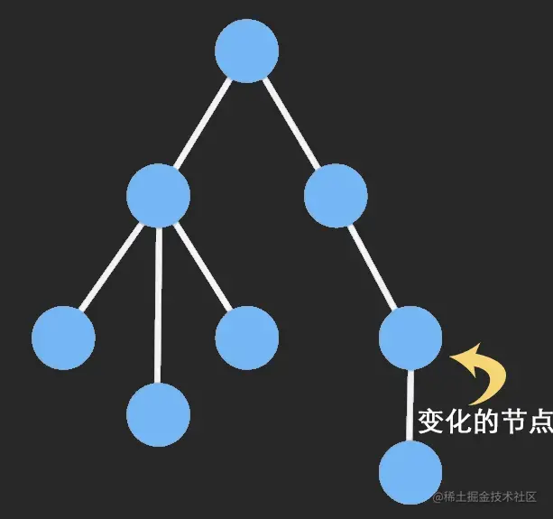

## react render 触发机制

[React组件到底什么时候render啊](https://juejin.cn/post/6886766652667461646)

1. state直接改变
React 组件的更新是由组件状态改变引起的，这里的状态一般指组件内的state对象，当某个组件的state发生改变。
- 在class component 中，只要使用this.setState就会触发render
- 在function component 中， 使用useState会触发，但是state值需要改变。
与render中是否由state无关（所以需要做优化，通过比较相关state来决定是否render），Vue是利用render watcher来做监听的，所以template没有响应式数据是不会触发patch更新。

2. props 改变
外部传进来的props会使组件更新，这里父组件执行render会使子组件触发render(这里组件触发更新默认会引起子组件更新，但是不会影响父组件以及兄弟组件)

## React.memo

因为父组件的重新渲染默认情况会导致子组件的强制渲染，尽管子组件不依赖任何props，或者相关props没有变化。这时候需要使用React.memo，他相当于PrueComponent，会对props进行浅比较。

### React.memo vs useMemo
- React.memo是HOC高阶组件，传递一个组件，返回一个新组建。useMemo是hook，只能在函数组件中使用

## immutable 优化
[immutable 优化](https://juejin.cn/post/6844903482206470152)

#### mutable
在javascript中，引用类型的数据，优点在于频繁的操作数据都是在原对象的基础上修改，不会创建新对象，从而可以有效利用内存，这种特性成为mutable（可变）

### 什么是immutable
immutable数据一种利用结构共享形成的持久化数据结构，一旦有部分被修改，那么将返回一个全新的对象，并且原来相同的节点会直接共享。
具体来说，immutable对象数据内部采用的是多叉树结构，凡是节点被改变，那么它和它相关的所有上级节点都更新。

只更新了父节点，比直接比对所有属性简直强太多了，并且更新后返回了一个全新的引用，即使是浅比较，也能感知到数据的变化。（因为只有子孙有更新，父也更新了）

- Persistent data structure（持久化数据结构）
- structural sharing （结构共享）
- support lazy operation（惰性操作Seq）
```js
const arr = Immutable.Seq([1, 2, 3, 4, 5, 6, 7, 8])
  .filter(item => {
    console.log('filter' + item);
    return item % 2;
  })
  .map(item => item * item);
  // 此时不会有打印，当获取值时才会运行，并且只会运行需要的。
  console.log(arr.get(1)); // filter1 filter2 filter3 9
```
#### 优点
- 降低mutable带来的复杂度
- 节省内存
- 历史追溯性：每时每刻的值都被保留了，想回退到哪一步只要简单的将数据取出就行，想一下如果现在页面有个撤销操作，撤销前的数据被保留了，只需要取出就行，这个特性在redux特别有用
- 拥抱函数式编程：immutable本来就是函数式编程的概念，纯函数式编程的特点就是，只要输入一致，输出必然一致，相比于面向对象，这样开发组件和调试更方便
#### 缺点
- 学习成本
- 资源包大小增加
- 容易与原生对象混淆

#### 注意点
- fromJS和toJS会深度转换数据，随之带来的开销较大，尽可能避免使用，单层数据转换使用Map()和List()
- js是弱类型，但Map类型的key必须是string！
```js
let obj = {a: 'one' }
Object.keys(obj) // ["1"]
obj['1'] // one
obj[1] // one

let map = Map(obj)
map.get('1') // one
map.get(1) // undefined
```
- 所有针对immutable变量的增删改必须左边有赋值，因为所有操作都不会改变原来的值，只是生成一个新的变量
```js
// javascript
var arr = [1,2,3,4]
arr.push(5)
console.log(arr) // [1,2,3,4,5]

// immutable
var arr = immutable.fromJS([1,2,3,4])
// 错误用法
arr.push(5)
console.log(arr) // [1,2,3,4]
// 正确用法
arr =arr.push(5)
console.log(arr) // [1,2,3,4,5]
```
- 引入immutablejs后，不应该再出现对象数组拷贝的代码
```js
//es6对象复制
var state = Object.assign({}, state, {
    key: value
});

//array复制
var newArr = [].concat([1,2,3])
```
- 获取深层深套对象的值时不需要做每一层级的判空
```js
//javascript
var obj = {a:1}
var res = obj.a.b.c   //error

//immutable
var immutableData=immutable.fromJS({a:1})
var res = immutableData.getIn(['a', 'b', 'c'])  //undefined
```
- immutable对象直接可以转JSON.stringify(),不需要显式手动调用toJS()转原生
- 判断对象是否是空可以直接用size
- 调试过程中要看一个immutable变量中真实的值，可以chrome中加断点，在console中使用.toJS()方法来查看