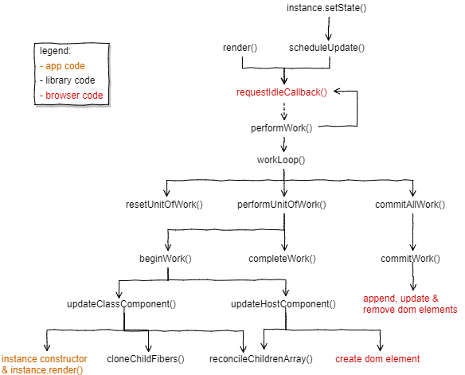

## 调度流程



### render() & scheduleUpdate()
- render()是在组件挂载的时候执行
- scheduleUpdate是在setState执行
两者都会将更新放到updateQueue队列，并等下一个浏览器空闲时在执行
```js
// Fiber tags
const HOST_COMPONENT = "host";
const CLASS_COMPONENT = "class";
const HOST_ROOT = "root";

// Global state
const updateQueue = [];
let nextUnitOfWork = null;
let pendingCommit = null;

function render(elements, containerDom) {
  updateQueue.push({ // 用作一个队列, 先进先出
    from: HOST_ROOT,
    dom: containerDom,
    newProps: { children: elements }
  });
  requestIdleCallback(performWork); // 下一个浏览器空闲时
}

function scheduleUpdate(instance, partialState) { // 提供给 setState 使用
  updateQueue.push({
    from: CLASS_COMPONENT,
    instance: instance,
    partialState: partialState
  });
  requestIdleCallback(performWork);
}
```

### performWork & workLoop
- performWork检查是否还有待审批的工作，如果有的话，它会为它自己安排一个新的requestIdleCallback(performWork)
- workLoop()时关注时间的函数，如果deadline时间太少，它会停止工作循环，并保持下一次nextUnitOfWork更新需要的Fiber状态，以便下次恢复
```js
const ENOUGH_TIME = 1; // milliseconds

function performWork(deadline) {
  workLoop(deadline);
  if (nextUnitOfWork || updateQueue.length > 0) {
      // 是否 有 待审批工作
    requestIdleCallback(performWork);
  }
}

function workLoop(deadline) {
  if (!nextUnitOfWork) {
    resetNextUnitOfWork();
  }
  while (nextUnitOfWork && deadline.timeRemaining() > ENOUGH_TIME) {
      // 关注时间 是否足够 运行另一个工作单元
    nextUnitOfWork = performUnitOfWork(nextUnitOfWork);
  }
  if (pendingCommit) {
    // 将改变DOM, 它应该一次完成, 以避免不一致的UI.
    commitAllWork(pendingCommit);
  }
}
```

### resetNextUnitOfWork
resetNextUnitOfWork获取依次更新，并将其转换成第一个nextUnitOfWork
```js
function resetNextUnitOfWork() {
  // 1. 首先从队列中提取第一个更新
  const update = updateQueue.shift();
  if (!update) {
    return;
  }

  // 2. 如果有更新，将partialState存储在属于组件实例的Fiber上，以便稍后再调用组件render时使用它
  if (update.partialState) {
    update.instance.__fiber.partialState = update.partialState;
  }

  // 3. 找到旧Fiber树的根。如果更新时第一次调用render，我们不会有根Fiber，所以root === null。如果它来自后续的render调用，我们可以再DOM节点的_rootContainerFiber属性上找到根。如果更新来自依次setState，我们需要从实例Fiber往上找，直到找到一个没有parent的Fiber
  const root =
    update.from == HOST_ROOT
      ? update.dom._rootContainerFiber
      : getRoot(update.instance.__fiber);

  // 4. 然后我们让nextUnitOfWork重新获取得到一个新的Fiber，这个Fiber是一个新的工作树的根
  nextUnitOfWork = {
    tag: HOST_ROOT,
    stateNode: update.dom || root.stateNode, // 两种情况
    props: update.newProps || root.props,
    alternate: root
  };
}

function getRoot(fiber) {
  let node = fiber;
  while (node.parent) {
    node = node.parent;
  }
  return node;
}
```

### performUnitOfWork
performUnitOfWork 会运行进行中的工作树
```js
function performUnitOfWork(wipFiber) {
  // 1. 创造一个新的Fiber孩子，然后让第一个孩子返回，成为nextUnitOfWork
  beginWork(wipFiber);
  if (wipFiber.child) { // 工作没有完成, 返回下一次更新的状态
    return wipFiber.child;
  }

  // 2. 如果没有孩子，接着执行completeWork，并返回sibling作为nextUnitOfWork
  let uow = wipFiber;
  while (uow) {
    completeWork(uow);
    if (uow.sibling) {
      // Sibling 返回, 再次变为 wipFiber, 被 beginWork 调用
      return uow.sibling;
    }
    // 3. 如果没有sibling，我们会继续往parent中找，completeWork直到我们找到sibling（将成为nextUnitOfWork）或到达根部
    uow = uow.parent;
  }
}
```

### beginWork
beginWork做两件事：
1. 创造stateNode，如果没有
2. 获取组件子项并将他们传递给reconcileChildrenArray
```js
function beginWork(wipFiber) {
  if (wipFiber.tag == CLASS_COMPONENT) {
    updateClassComponent(wipFiber);
  } else {
    updateHostComponent(wipFiber);
  }
}

// 处理主机组件以及根组件
function updateHostComponent(wipFiber) {
  if (!wipFiber.stateNode) {
    // 创建一个新的DOM节点（只有一个节点，没有子节点，并且不会将其附加到DOM）
    wipFiber.stateNode = createDomElement(wipFiber);
  }
  const newChildElements = wipFiber.props.children;
  // 通过调用reconcileChildrenArray，使用来自Fiber中props属性的子元素
  reconcileChildrenArray(wipFiber, newChildElements);
}

// 处理类组件实例
function updateClassComponent(wipFiber) {
  let instance = wipFiber.stateNode;
  if (instance == null) {
    // 调用类初始化
    instance = wipFiber.stateNode = createInstance(wipFiber);
  } else if (wipFiber.props == instance.props && !wipFiber.partialState) {
    // 不需要更新,最后 复制 孩子
    cloneChildFibers(wipFiber);
    return;
  }

  // 更新实例的props，state
  instance.props = wipFiber.props;
  instance.state = Object.assign({}, instance.state, wipFiber.partialState);
  wipFiber.partialState = null;

  // 获取新的孩子
  const newChildElements = wipFiber.stateNode.render();
  reconcileChildrenArray(wipFiber, newChildElements);
}
```

### reconcileChildrenArray
```js
// Effect tags
const PLACEMENT = 1;
const DELETION = 2;
const UPDATE = 3;

function arrify(val) {
  return val == null ? [] : Array.isArray(val) ? val : [val];
}

function reconcileChildrenArray(wipFiber, newChildElements) {
  // 确保newChildElements是个数组（与之前的对比算法不同, 这个算法总是与子数组一起工作, 这意味着我们现在可以在组件的render()函数上返回数组）
  const elements = arrify(newChildElements);

  let index = 0;
  // 获取旧Fiber
  let oldFiber = wipFiber.alternate ? wipFiber.alternate.child : null;
  let newFiber = null;
  while (index < elements.length || oldFiber != null) {
    const prevFiber = newFiber;
    const element = index < elements.length && elements[index];
    const sameType = oldFiber && element && element.type == oldFiber.type;

    // 相同type，同为原生标签、相同组件、文本，创建一个基于旧fiber的新fiber
    if (sameType) {
      newFiber = {
        type: oldFiber.type,
        tag: oldFiber.tag,
        stateNode: oldFiber.stateNode,
        props: element.props,
        parent: wipFiber,
        alternate: oldFiber,
        partialState: oldFiber.partialState,
        effectTag: UPDATE // 更新
      };
    }

    // 存在新节点，但是type不相同，基于新节点创建新fiber
    if (element && !sameType) {
      newFiber = {
        type: element.type,
        tag:
          typeof element.type === "string" ? HOST_COMPONENT : CLASS_COMPONENT,
        props: element.props,
        parent: wipFiber,
        effectTag: PLACEMENT
      };
    }

    // 存在旧节点，但是type不相同，将旧节点标记为DELETION并存入wipFiber树的effects中
    if (oldFiber && !sameType) {
      oldFiber.effectTag = DELETION;
      wipFiber.effects = wipFiber.effects || [];
      wipFiber.effects.push(oldFiber);
    }

    if (oldFiber) {
      // 旧的下一个兄弟Fiber
      oldFiber = oldFiber.sibling;
    }

    将新Fiber放到wipFiber树上
    if (index == 0) {
      wipFiber.child = newFiber;
    } else if (prevFiber && element) {
      prevFiber.sibling = newFiber;
    }

    index++;
  }
}
```

### cloneChildFibers
updateClassComponent 有一个特殊情况，当props相同并且不存在partialState更新，那么直接将旧Fiber子树克隆到正在进行中的工作树。
```js
function cloneChildFibers(parentFiber) {
  const oldFiber = parentFiber.alternate;
  if (!oldFiber.child) {
    return;
  }

  let oldChild = oldFiber.child;
  let prevChild = null;
  while (oldChild) {
    const newChild = {
      type: oldChild.type,
      tag: oldChild.tag,
      stateNode: oldChild.stateNode,
      props: oldChild.props,
      partialState: oldChild.partialState,
      alternate: oldChild,
      parent: parentFiber
    };
    // 如果时第一个child，将新fiber放到放到父Fiber的child上，否则将新fiber放到上个fiber的sibling上
    if (prevChild) {
      prevChild.sibling = newChild;
    } else {
      parentFiber.child = newChild;
    }
    // 移动指针，当前child赋值给上一个child，下一个旧fiber赋值给当前旧fiber
    prevChild = newChild;
    oldChild = oldChild.sibling;
  }
}
```

### completeWork
再performUnitOfWork，当wipFiber没有新的孩子或者已经完成了所有孩子的工作，执行completeWork()
```js
function completeWork(fiber) {
  // 更新与CLASS_COMPONENT实例相关的fiber引用
  if (fiber.tag == CLASS_COMPONENT) {
    fiber.stateNode.__fiber = fiber;
  }

  if (fiber.parent) {
    // 创建effects列表，在根effects列表中集合所有的Fiber.effectTag.
    const childEffects = fiber.effects || [];
    const thisEffect = fiber.effectTag != null ? [fiber] : [];
    const parentEffects = fiber.parent.effects || [];
    fiber.parent.effects = parentEffects.concat(childEffects, thisEffect);
  } else {
    // 如果Fiber没有parent, 我们拿到了 正在进行工作的树的根. 所以我们完成了这次更新的所有工作,并收集了所有的effects. 我们分配根到pendingCommit,以便workLoop()中commitAllWork()可以调用.
    pendingCommit = fiber;
  }
}
```

### commitAllWork

更新DOM
```js
function commitAllWork(fiber) {
  fiber.effects.forEach(f => {
    commitWork(f);
  });
  fiber.stateNode._rootContainerFiber = fiber;
  nextUnitOfWork = null; // Reset
  pendingCommit = null;
}

function commitWork(fiber) {
  if (fiber.tag == HOST_ROOT) {
    return;
  }

  let domParentFiber = fiber.parent;
  while (domParentFiber.tag == CLASS_COMPONENT) {
    domParentFiber = domParentFiber.parent;
  }
  // 找到父元素
  const domParent = domParentFiber.stateNode;

  if (fiber.effectTag == PLACEMENT && fiber.tag == HOST_COMPONENT) {
    // 新增
    domParent.appendChild(fiber.stateNode); // add
  } else if (fiber.effectTag == UPDATE) {
    // 更新
    updateDomProperties(fiber.stateNode, fiber.alternate.props, fiber.props);
  } else if (fiber.effectTag == DELETION) {
    // 删除
    commitDeletion(fiber, domParent);
  }
}

// 如果它是DELETION并且Fiber是主机组件, 那很简单, 我们只是removeChild(). 但是如果Fiber是类组件, 在调用removeChild()之前, 我们需要从Fiber子树中,找到需要删除的所有主机组件.
function commitDeletion(fiber, domParent) {
  let node = fiber;
  while (true) {
    if (node.tag == CLASS_COMPONENT) {
      node = node.child;
      continue;
    }
    domParent.removeChild(node.stateNode);
    while (node != fiber && !node.sibling) {
      node = node.parent;
    }
    if (node == fiber) {
      return;
    }
    node = node.sibling;
  }
}
```
