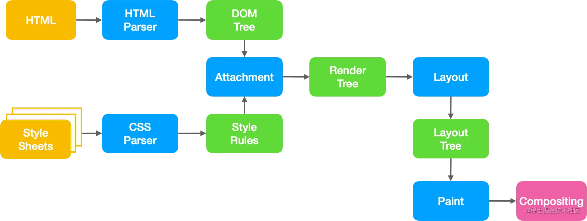
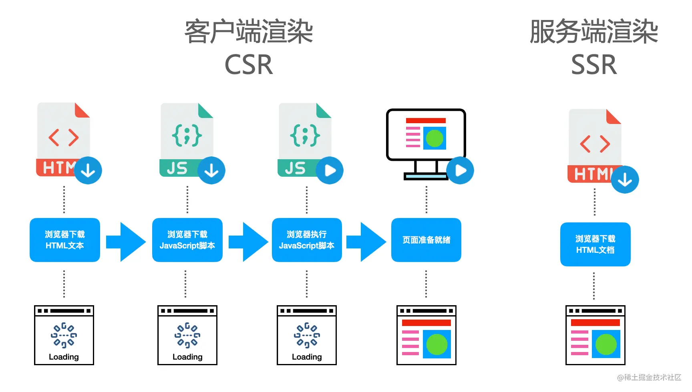

# Render
## 页面渲染流程

- 浏览器通过请求得到一个HTML文本
- 渲染进程解析`HTML`文本，构建`DOM`树
- 浏览器解析`HTML`的同时，如果遇到外联样式，则下载并构建样式规则（`style rules`）。若遇到`Javascript`脚本，则会下载并执行脚本。
- `DOM`树和样式规则构建完成后，渲染进程将两者合并成渲染树（`render tree`）。
- 渲染进程开始对渲染树进行布局，生成布局树（`layout tree`）。
- 渲染进程对布局树进行绘制，生成绘制记录。
- 渲染进程对不拘束进行分层，分别栅格化每一层并合并成帧
- 渲染进程将合成帧发送给`GPU`进程将图像绘制到页面中。

## 客户端渲染CSR

如今我们大部分`Web`应用都是使用`JavaScript`框架进行页面渲染的，页面中的大部分`DOM`元素都是通过`JaveScript`插入的。也就是说，在执行`Javascript`脚本前，`HTML`页面已经开始解析并构建`DOM`树了，`Javascript`脚本只是动态的改变`DOM`树结构，是页面成为希望成为的样子，这种渲染叫做动态渲染，也就是`客户端渲染CSR（client side render）`。async

## 服务端渲染SSR

顾名思义，服务端渲染就是在浏览器请求`URL`的时候，服务端将我们需要的`HTML`文本组装好，并返回给浏览器，这个`HTML`文本被浏览器解析之后，不需要经过`Javascript`脚本的下载过程，即可直接构建出我们所希望的`DOM`树并展示到页面中。这个服务端组装`HTML`的过程叫做`服务器渲染SSR（server side render）`。 defer

## 静态站点生成SSG

与`SSR`的相同之处就是对应的服务器同样是将已经组合好的`HTML`文档直接返回给客户端，所以客户端依旧不需要下载`Javascript`，文本就能渲染出整个页面。
使用了`SSG`技术搭建出的网站，整个页面对应的`HTML`文档在项目`build`打包构建时，就已经生成好了，用户请求的时候服务端不需要再发送其他请求和进行二次组装，直接将该`HTML`文档响应给客户端即可，客户端端与服务端之间的通信也就变的更加简单。
缺点：
- `HTML`文档既然是再项目打包时就已经生成好的，那么所有用户看到的都只能是同一个页面，就像是一个静态网站一样，这也是这项技术的关键字眼--静态
- 每次更改内容时都需要构建和部署应用程序，所以具有很强的局限性，不适合制作内容经常会变更的网站

