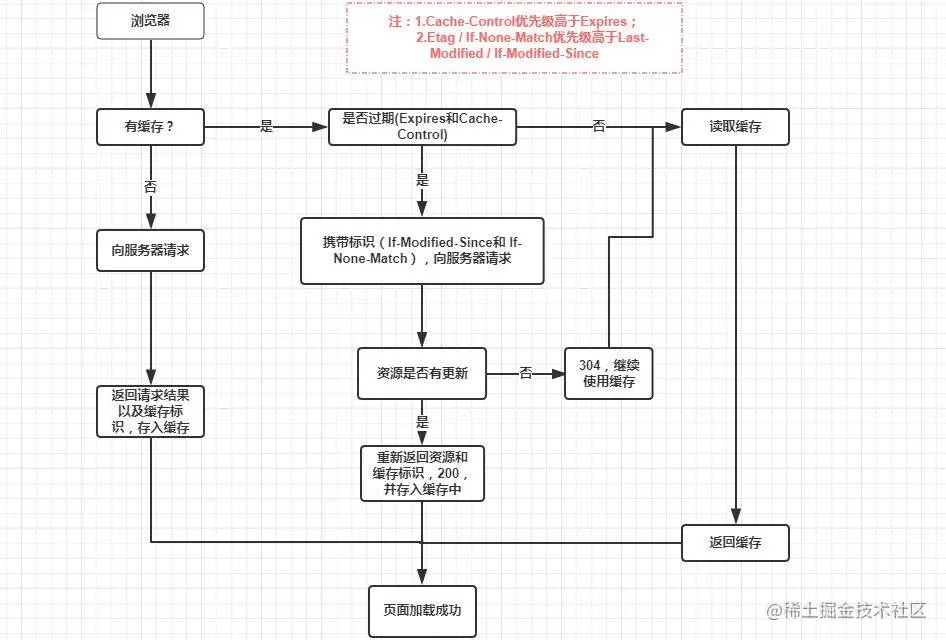

## 缓存的优势
- 缓解服务器压力，不用每次都去请求某些数据了
- 提升性能，打开本地资源肯定比请求服务器快
- 减少带宽消耗，当我们使用缓存的时候，只会产生很小的网络消耗

## Web缓存种类
- 数据库缓存：当web应用关系复杂，数据量很大，可以将查询后的数据放到内存中进行缓存，下次再查询就直接从内存缓存中获取，从而提高响应速度
- CDN缓存：当我们发送一个web请求时，CDN会帮我们计算去哪得到这些内容的路径最短最快。这个是网站管理员部署的，所以他们也可以将大家经常访问的内容放到CDN里，从而加快响应
- 代理服务器缓存：跟浏览器缓存性质类似，但是代理服务器缓存面向的全体更广，规模更大。它不只为了一个用户服务，一般为大量用户提供服务，同一个副本被重用多次，因此减少响应事件和宽带使用。
- 浏览器缓存：包含强缓存和协商缓存，通过浏览器使用HTTP协议与服务器交互的时候，浏览器会根据一套与服务器约定的规则进行缓存工作。

## 强缓存
当我们访问URL时，不会向服务器发送请求，直接从缓存读取资源，但是会返回200状态。

第一次进入页面，请求服务器，然后服务器进行答应，浏览器会根据请求头来判断是否有缓存（expires，cache-control），如果缓存中没有，浏览器就会把资源缓存在内存或者磁盘中。
第二次请求时，浏览器判断请求参数，如果返回强缓存条件就直接返回200，从本地缓存拿数据，否则看是否符合协商缓存（If-Modified-Since,If-None-Match）符合则返回304，不符合则服务器会返回全新资源。

### expires

HTTP1.0控制网页缓存的字段，值为时间戳，服务器返回该请求结果缓存的到期时间。
缺点：判断是否过期是用本地时间来判断，本地时间是可以修改的。

### pragma
HTTP1.0禁用网页缓存的字段，值为no-cache，和Cache-Control: no-cache效果一样

### Cache-Control
HTTP1.1中控制网页缓存的字段，优先级高于expires。
- public：资源客户端和服务端都可以缓存
- privite：资源只有客户端可以缓存
- no-cache：客户端缓存资源，但是是否缓存需要经过协商缓存来校验（no-cache/max-age=0会使用协商缓存）
- no-store：不使用缓存
- max-age：缓存保质期

Cache-Cantrol使用的max-age是相对时间，解决了expires问题

## 协商缓存
协商缓存就是强缓存失效后，浏览器携带缓存标识向服务器发送请求，由服务器根据缓存标识来决定是否使用缓存的过程。
如果协商缓存生效，则返回304；失败则返回200，直接从服务器获取数据。

### Last-Modified/If-Modified-Since
Last-Modifieds是服务器响应请求时，返回资源文件在服务器最后被修改的时间。
If-Modified-Since则是客户端再次发起请求时，携带上次请求返回的Last-Modified值，通过此字段值告诉服务器该资源上次请求返回的最后被修改时间。两者最对比，若无服务器资源最后被修改时间大于If-Modified-Since（上次修改时间）的字段值，则重新返回资源，状态码200；否则返回304，代表资源无更新，可继续使用缓存。

### Etag/If-None-Match
Etag是服务器响应请求时，返回当前资源文件的一个唯一标识（由服务器生成）
If-None-Match是客户端再次发起该请求时，携带上次请求返回的唯一标识Etag。两者相对比，如果一直返回304，代表不需要更新，不一致则重新返回资源文件200

Etag / If-None-Match优先级高于Last-Modified / If-Modified-Since，同时存在则只有Etag / If-None-Match生效。

### 对比优缺点
- Last-Modified 本地打开了缓存文件，并没有进行修改，也还是会改变修改时间，导致缓存失败
- Last-Modified 时以秒来计时的，如某文件在一秒内多次修改，这时候Last-Modified就没有体现出修改
- ETag性能不足，文件只要发生改变Etag就会改变。需要通过服务器算法计算出hash值。

## 缓存位置

### Service Worker
运行在浏览器背后的独立线程，也就是说它脱离了浏览器窗体，无法直接访问DOM，功能上主要能实现：离线缓存，消息推送，网络代理等

### Memory Cache
内存存储
- 读取效率快，缓存持续时间短，随着进程的释放而释放（一旦关闭Tab页面就被释放了）
- 几乎所有的请求资源都能进入memory cache，主要分为preloader和preload
- 在从memory Cache读取缓存时, 浏览器会忽视Cache-Control中的一些max-age、no-cache等头部配置, 除非设置了no-store这个头部配置.

### Disk Cache
存储在硬盘上
- 比内存缓存慢，但是存储时间长，容量更大
- 比较大的文件一般存储到硬盘上
- 当钱系统内存使用率比较高的时候，文件优先存入硬盘

### Push Cache
推送缓存，他是浏览器缓存的最后一段防线。当以上三种缓存都没有命中，他才会被使用。
我所知道的, 它只会在会话(Session)中存在, 一旦会话结束它就会被释放, 并且缓存时间也很短暂, 在Chrome浏览器中只有5分钟.
另外由于它是 HTTP/2 中的内容, 因此在国内不是很普及, 这里贴上一个比较好的总结:
- 所有的资源都能被推送，并且能够被缓存,但是 Edge 和  Safari 浏览器支持相对比较差
- 可以推送 no-cache 和 no-store 的资源
- 一旦连接被关闭，Push Cache 就被释放
- 多个页面可以使用同一个HTTP/2的连接，也就可以使用同一个Push Cache。这主要还是依赖浏览器的实现而定，出于对性能的考虑，有的浏览器会对相同域名但不同的tab标签使用同一个HTTP连接。
- Push Cache 中的缓存只能被使用一次
- 浏览器可以拒绝接受已经存在的资源推送
- 你可以给其他域名推送资源

## 刷新对于缓存影响
- ctrl+F5 将之刷新网页，直接从服务器加载，跳过强缓存和协商缓存
- F5刷新，跳过强缓存，但会检查协商缓存
- 浏览器地址写入url，回车 浏览器发现缓存中有这个文件了，不用继续请求了，直接去缓存拿。（最快）

## 配置缓存
- 对于img，css，js等非html资源，可以直接考虑强缓存，并将max-age配置时间设置尽可能长(这样配置并不代表这些资源一定常年不变，现在前端构建工具再静态资源都会加入hash，资源改变会导致请求地址改变)
- 对于html资源，根据项目更新频率来确定采用的方案。html作为前端资源入口文件，一旦被强缓存，那么相关js，css，img等均无法更新。对于高频维护的业务类项目，建议走协商缓存。