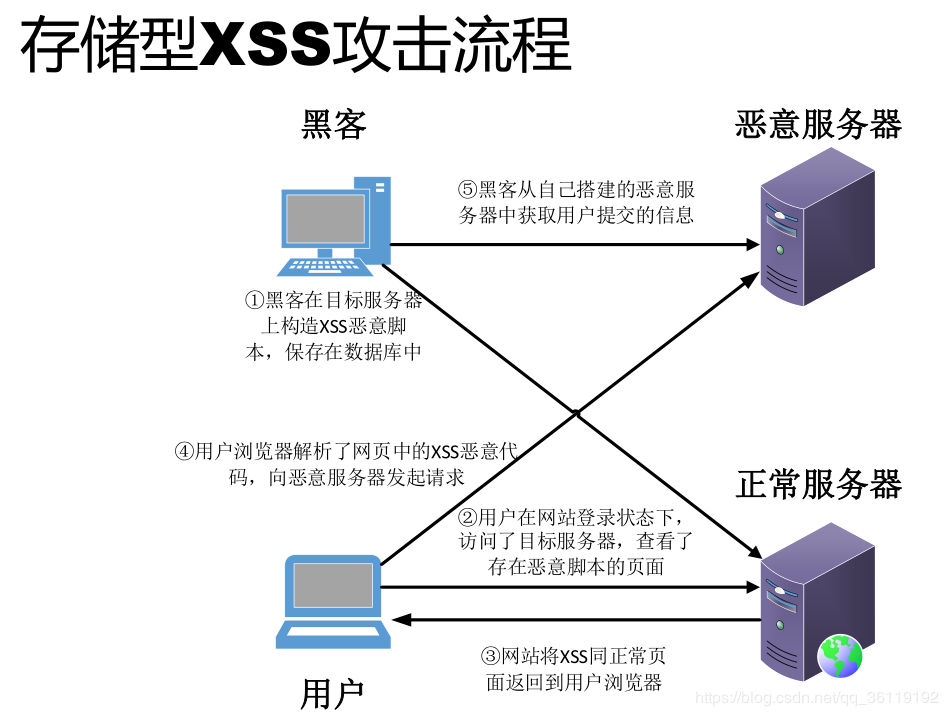
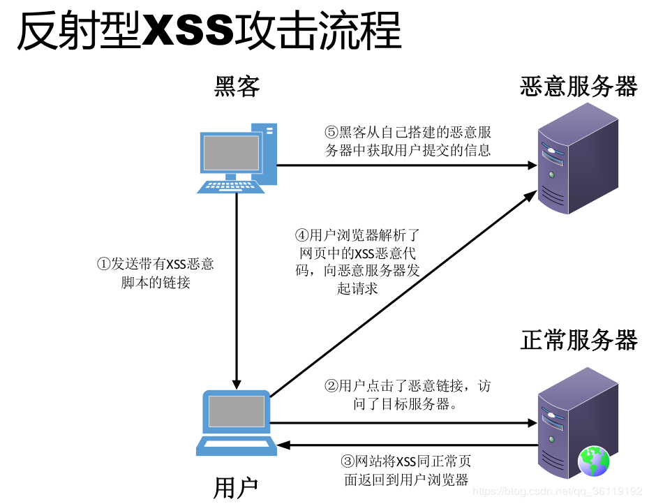

# 网络安全

## XSS(Cross Site Scripting跨站点脚本攻击)

XSS 攻击是指往页面恶意的注入脚代码本。当用户浏览该页时，嵌入其中的 Script 代码会被执行，从而达到恶意攻击用户的目的。

- 存储型

黑客利用站点漏洞将一段恶意 JavaScript 代码提交到网站的数据库中 **存储** ，当用户访问网站的时候，网站将恶意脚本同正常页面一起返回，浏览器解析执行了网站中的恶意脚本，将用户的 Cookie 信息等数据上传到恶意服务器。



评论发帖私信 注入脚本 存入数据库。

- 反射型

黑客通过特定的手段（例如电子邮件等），诱导用户去访问一个包含恶意脚本的 URL，当用户访问这个带有恶意脚本的 URL 时，网站又把恶意 JavaScript 脚本返回给用户执行



通常出现在网站的搜索栏、用户登录口等地方，常用来窃取客户端 Cookies 或进行钓鱼欺骗

- dom 型

通过恶意脚本修改页面的 DOM 结构，是纯粹发生在客户端的攻击。

DOM 型 XSS 攻击中，取出和执行恶意代码由浏览器端完成，属于前端 JavaScript 自身的安全漏洞。

### 如何阻止 XSS 攻击

1. 过滤特殊字符，或对特定字符进行编译转码

2. 对重要的 cookie 设置 httpOnly
   通过对重要的 Cookie 设置 httpOnly ，防止客户端通过 document.cookie 读取 cookie ，也就是说，JavaScript 读取不到此条 Cookie ，也就无法提交给恶意服务器了
3. CSP（Content-Security Policy内容安全策略）配置可信白名单，来限制是否可以包含某些来源内容

#### Vue 是如何阻止 XSS 的

- 对特定字符进行编译转码
  使用 textContent 替代 innerHTML（textContent 会对文本进行编译转码再插入） 同理 使用 setAttribute 来添加属性。

- 类似 CodePen 和 JSFiddle 需要使用用户的 html css JavaScript，可以使用 iframe 将它隔离在沙箱中。

- 注入 url
  url 对于链接跳转，如 <a href="xxx"> 或 location.href="xxx"，要检验其内容，禁止以 javascript: 开头的链接，和其他非法的 scheme。

- 永远不要向 Vue 挂载可能包含服务端渲染或用户提供的内容。

## CSRF(跨站点请求伪造)

攻击者诱导受害者进入第三方网站，在第三方网站中，向被攻击网站发送跨站请求。利用受害者在被攻击网站已经获取的注册凭证，绕过后台的用户验证，达到冒充用户对被攻击的网站执行某项操作的目的。

- 自动发起 GET 请求的 CSRF
  攻击者将支付的接口请求隐藏在 img 标签内，在加载这个标签时，浏览器会自动发起 img 的资源请求，a.com 就会收到包含受害者登录信息的一次跨域请求

```html

```

- 自动发起 POST 请求的 CSRF

访问该页面后，表单会自动提交，相当于模拟用户完成了一次 POST 操作。

```html
<form action="http://a.com/pay" method="POST">
  <input type="hidden" name="account" value="sisterAn" />
  <input type="hidden" name="amount" value="10000" />
  <input type="hidden" name="for" value="hacker" />
</form>
<script>
  document.forms[0].submit()
</script>
```

- 引诱用户点击链接的 CSRF

链接类型的 CSRF 并不常见，比起其他两种用户打开页面就中招的情况，这种需要用户点击链接才会触发。这种类型通常是在论坛中发布的图片中嵌入恶意链接，或者以广告的形式诱导用户中招，攻击者通常会以比较夸张的词语诱骗用户点击，例如：

```html
<div>
  </img>
  <a href="https://a.com/pay?amount=10000&for=hacker" taget="_blank">
    点击查看更多美女
  </a>
</div>
```

### 如何阻止 CSRF 攻击

1. 利用 Cookie 的 SameSite 属性

我们可以将 SameSite 设置为 Strict 或 Lax 来解决 Cookie 问题

- Strict 浏览器完全禁止第三方拿到 Cookie

- Lax 默认，相对宽松一点，在跨站点的情况下，从第三方站点的链接打开或 Get 方式的表单提交这两种方式都会携带 Cookie；除此之外，如 Post 请求、 img、iframe 等加载的 URL，都不会携带 Cookie
  None：最宽松，在任何情况下都会发送 Cookie 数据

2. 利用同源策略

服务端通过判断请求携带的 origin，referer 是否为同源站点。

- Referer Header：记录该请求的来源地址（含 URL 路径）
- Origin Header：记录该请求的域名信息（不含 URL 路径）

3. token 认证

- 在用户登录时，服务器生成一个 Token 返回给用户
- 在浏览器端向服务器发起请求时，带上 Token，服务器端验证 Token

4. 验证码
